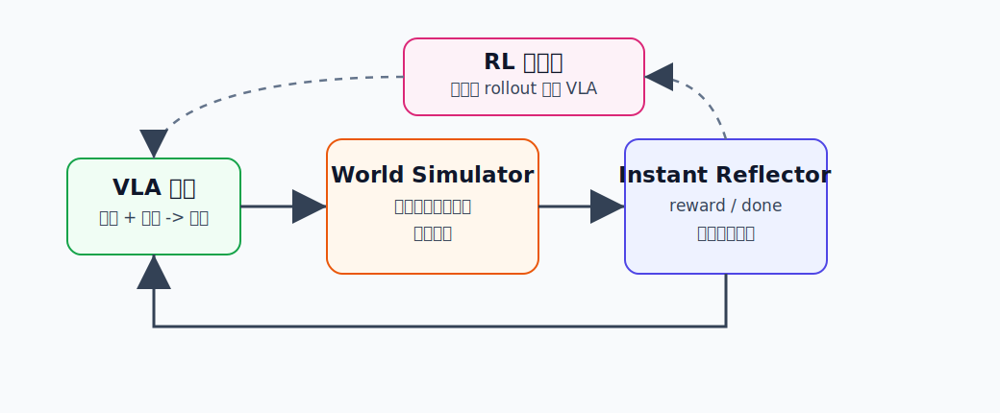

World-Env
========================================

World-Env 是什么
----------------------------------------

World-Env 全称是 **World-Env: Leveraging World Model as a Virtual Environment for VLA Post-Training**。

它的核心思想很直观：

**把世界模型当成一个低成本虚拟环境，让 VLA 策略在里面做 RL 后训练。**

.. code-block:: text

   VLA 输出动作 -> 世界模型生成下一步观测 -> 反思器给奖励/终止信号 -> RL 更新 VLA

它和 Dreamer 有相似处：都利用世界模型减少真实环境交互。但 World-Env 更面向 **VLA post-training**，也就是已经通过模仿学习训练好的视觉语言动作模型，再用 RL 做进一步提升。

为什么提出 World-Env
----------------------------------------

VLA 模型通常依赖大量专家演示数据。但现实里，机器人演示数据很贵，很多任务可能只有少量示范。

直接用真实机器人做 RL 后训练又有几个麻烦：

- 真实环境不可随便 reset。机械臂把东西推乱后，往往需要人工复位。
- 失败动作可能有风险，尤其在工业自动化或贵重设备场景。
- 每次交互都慢，采样效率低。
- 任务什么时候完成，有时也很难自动判断。

World-Env 要解决的问题是：

**能不能不在真实世界里试错，而是在世界模型构造的虚拟环境里做 VLA 强化学习？**

核心技术讲解
----------------------------------------

世界模型作为虚拟环境
~~~~~~~~~~~~~~~~~~~~~~~~~~~~~~~~~~~~~~~~

传统 RL 的环境会接收动作并返回下一状态：

.. code-block:: text

   action -> environment -> next observation

World-Env 把真实环境替换成 world model：

.. code-block:: text

   action -> world model -> predicted next observation

对 VLA 来说，输入通常是图像和语言指令，所以 World-Env 的世界模型重点是生成时间一致的未来视觉观测。

这相当于给 VLA 搭了一个“可反复试错的想象环境”。

VLA 策略闭环
~~~~~~~~~~~~~~~~~~~~~~~~~~~~~~~~~~~~~~~~

World-Env 不是只预测一次未来，而是让 VLA 和世界模型形成闭环：

.. code-block:: text

   当前图像 + 指令
        ↓
   VLA 输出动作
        ↓
   世界模型生成下一帧/下一段观测
        ↓
   VLA 继续决策

这样才能模拟一个完整任务过程，而不是只看单步预测。

VLM-guided Instant Reflector
~~~~~~~~~~~~~~~~~~~~~~~~~~~~~~~~~~~~~~~~

RL 训练需要奖励信号。真实环境中，奖励可以来自传感器、人工规则或任务成功检测；但在世界模型里，需要一个模块判断“现在做得怎么样”。

World-Env 使用 VLM-guided instant reflector，可以理解成一个视觉语言反思器：

- 看当前生成的观测。
- 结合任务指令。
- 判断进度和成功概率。
- 给出连续 reward。
- 判断是否应该终止动作。

通俗地说，它像一个旁观老师，边看机器人在虚拟环境里操作，边给反馈：

.. code-block:: text

   更接近目标了：奖励高一点
   已经完成任务：发出 done
   动作多余或偏离目标：奖励低一点

为什么需要终止判断
~~~~~~~~~~~~~~~~~~~~~~~~~~~~~~~~~~~~~~~~

很多 VLA 策略有一个问题：即使任务已经完成，模型也可能继续输出动作，导致本来成功的任务被破坏。

例如杯子已经放到目标位置，但机器人继续推一下，杯子又偏了。

World-Env 的 reflector 不只给奖励，还预测 action termination，让策略学会“什么时候该停”。

RL 后训练
~~~~~~~~~~~~~~~~~~~~~~~~~~~~~~~~~~~~~~~~

有了虚拟环境和奖励后，就可以对 VLA 做 RL 后训练。

流程大致是：

.. code-block:: text

   少量演示训练初始 VLA
          ↓
   VLA 在 World-Env 中 rollout
          ↓
   reflector 给 reward 和 done
          ↓
   用 RL 更新策略
          ↓
   得到更强的 VLA

这对数据稀缺场景很有用，因为模型可以在世界模型里探索一些演示之外的动作。

和 Dreamer 的区别
----------------------------------------

Dreamer 通常是从环境经验中学 latent world model，并在 latent imagination 里训练 actor-critic。

World-Env 更像是给 VLA 后训练造了一个虚拟机器人环境：

.. code-block:: text

   Dreamer：world model 是 RL agent 的内部想象器
   World-Env：world model 是 VLA post-training 的外部虚拟环境

它更贴近当前 VLA 模型的训练流程：先模仿学习，再用 RL 做提升。

和具身智能的关系
----------------------------------------

World-Env 的价值在于把世界模型变成 VLA 的训练场。

它可能帮助解决：

- 真实机器人 RL 成本高。
- 少量演示下泛化不足。
- 真实环境难以 reset。
- 任务完成检测不可靠。
- VLA 执行时动作冗余。

这正是具身智能走向真实部署时会遇到的现实问题。

局限
----------------------------------------

- 世界模型生成的未来可能不真实，RL 会利用模型漏洞。
- 长期闭环 rollout 可能出现误差累积。
- reflector 的奖励判断如果不准，会误导策略。
- 虚拟环境中学到的策略仍需要真实机器人验证。

小结
----------------------------------------

World-Env 的一句话理解是：**把世界模型当成 VLA 的虚拟训练环境，用低成本、安全的 RL 后训练提升机器人策略。**

它代表了 World Model for RL 从经典控制任务走向 VLA 后训练的一条路线。

参考
----------------------------------------

- Xiao et al., `World-Env: Leveraging World Model as a Virtual Environment for VLA Post-Training <https://arxiv.org/abs/2509.24948>`_, 2025.
